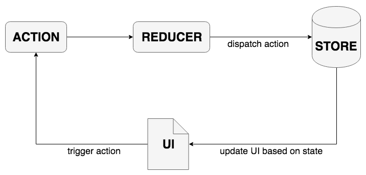
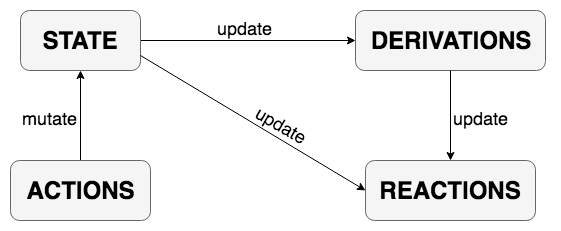

# Redux VS MobX

## Redux


> Redux is a predictable state container for JavaScript apps.

### Redux的核心概念
1. 单一的状态树
2. Action描述改变
3. Reducer执行改变

Redux的执行流程如下所示：UI展示页面基于Store的状态进行更新展示，用户交互促发事件（比如Click），事件通过Reducer派发Action更新Store。


### 基于Redux的Todo程序实现
**1. Action部分**

定义Action：（1）addTodo（添加Todo）（2）toggleTodo（切换Todo状态）

**./actions/index.js**

```
export const addTodo = text => {
  return {
    type: 'ADD_TODO',
    text
  }
}

export const toggleTodo = id => {
  return {
    type: 'TOGGLE_TODO',
    id
  }
}
```

**2. Reducer部分**

**./reducers/todo.js**

```
import uuid from 'node-uuid'

const todos = (state = [], action) => {
  switch (action.type) {
    case 'ADD_TODO':
      return [
        ...state,
        {
          id: uuid.v4(),
          text: action.text,
          completed: false
        }
      ]
    case 'TOGGLE_TODO':
      return state.map(todo =>
        (todo.id === action.id)
          ? {...todo, completed: !todo.completed}
          : todo
      )
    default:
      return state
  }
}

export default todos
```

**./reducers/index.js**

```
import { combineReducers } from 'redux'
import todos from './todo'

const todoApp = combineReducers({
  todos
})

export default todoApp
```


**3. 组件部分**

组件部分基于容器组件(Container Components)和展示组件(Presentational Components)相分离的开发思想。展示组件描述如何展示页面，负责页面的展示部分，数据直接来源于props；容器组件描述一个执行过程，数据来源于redux，主要作为Redux和React之间的一个桥接。

- Todo展示组件

展示组件部分主要用React做UI实现，同时为了保证props数据的准确性，额外添加了prop-types做了简单校验。

**./components/Todo.jsx**

```
import React from 'react'
import PropTypes from 'prop-types'

const Todo = ({ completed, text, onClick }) => (
  <li>
    <input
      type='checkbox'
      checked={completed}
      onClick={onClick}
    />
    {text}
  </li>
)

Todo.propTypes = {
  completed: PropTypes.bool.isRequired,
  text: PropTypes.string.isRequired,
  onClick: PropTypes.func.isRequired
}

export default Todo
```

**./components/TodoList.jsx**

```
import React from 'react'
import PropTypes from 'prop-types'
import Todo from './Todo'

const TodoList = ({ todos, unfinishedTodoCount, onTodoClick }) => (
  <div>
    <hr />
    <ul>
      {todos.map((todo) => (
        <Todo key={todo.id} {...todo} onClick={() => onTodoClick(todo.id)} />
      ))}
    </ul>
    Tasks left: {unfinishedTodoCount}
  </div>
)

TodoList.propTypes = {
  todos: PropTypes.arrayOf(
    PropTypes.shape({
      id: PropTypes.string.isRequired,
      completed: PropTypes.bool.isRequired,
      text: PropTypes.string.isRequired
    }).isRequired
  ).isRequired,
  unfinishedTodoCount: PropTypes.number.isRequired,
  onTodoClick: PropTypes.func.isRequired
}

export default TodoList
```

**./components/AddTodoForm.jsx**

```
import React from 'react'
import PropTypes from 'prop-types'

let AddTodoForm = ({ submitData }) => {
  let input

  return (
    <form onSubmit={e => {
      e.preventDefault()
      submitData(input.value)
      input.value = ''
    }}>
      New Todo:
      <input
        ref={node => { input = node }}
        type='text'
      />
      <button type='submit'>Add</button>
    </form>
  )
}

AddTodoForm.propTypes = {
  submitData: PropTypes.func.isRequired
}

export default AddTodoForm
```

- Todo容器组件

容器组件部分主要负责处理传递state和dispatch action，通过connect()将展示组件与Redux的state和action进行关联。

**./containers/ListTodo.js**

```
import { connect } from 'react-redux'
import { toggleTodo } from '../actions'
import TodoList from '../components/TodoList'

const mapStateToProps = state => {
  return {
    todos: state.todos,
    unfinishedTodoCount: state.todos.filter(todo => !todo.completed).length
  }
}

const mapDispatchToProps = dispatch => {
  return {
    onTodoClick: id => {
      dispatch(toggleTodo(id))
    }
  }
}

export default connect(
  mapStateToProps,
  mapDispatchToProps
)(TodoList)
```

**./containers/AddTodo.js**

```
import { connect } from 'react-redux'
import { addTodo } from '../actions'
import AddTodoForm from '../components/AddTodoForm'

const mapDispatchToProps = dispatch => {
  return {
    submitData: inputValue => {
      inputValue.trim() && dispatch(addTodo(inputValue))
    }
  }
}

export default connect(
  null,
  mapDispatchToProps
)(AddTodoForm)
```

**4. index入口文件**

将容器放到一个组件，初始化Store并通过Provider传递Store到所有容器组件中。`window.__REDUX_DEVTOOLS_EXTENSION__ && window.__REDUX_DEVTOOLS_EXTENSION__()`为Redux调试工具的配置设置。

**./index.js**

```
import React, { Component } from 'react'
import { Provider } from 'react-redux'
import { createStore } from 'redux'

import todoApp from './reducers'
import ListTodo from './containers/ListTodo'
import AddTodo from './containers/AddTodo'

export default class Redux extends Component {
  constructor (props) {
    super(props)

    this.store = createStore(
      todoApp,
      window.__REDUX_DEVTOOLS_EXTENSION__ && window.__REDUX_DEVTOOLS_EXTENSION__()
    )
  }

  render () {
    const store = this.store

    return (
      <Provider store={store}>
        <div>
          <h1>Redux</h1>
          <AddTodo />
          <ListTodo />
        </div>
      </Provider>
    )
  }
}
```

## MobX


> MobX is a simple, scalable and battle tested state management solution.

### MobX核心概念

“MobX 会对在**追踪函数**执行过程中读取现存的**可观察属性**做出反应”。

- **可观察属性**：`observable(value)`、`@observable classProperty = value`
- **追踪函数**： `(@)computed`、`autorun`、`when`、`reaction`、`(@)observer`

MobX的执行流程比较简单，不要求将State存储在Store树中，只要求对需要跟踪变化的state属性打上`observable`标签，并在追踪函数中对可观察的state属性进行更新操作即可。



### 基于MobX的Todo程序实现
**1. store设计**

MobX对State的操作非常灵活，可以不用对State专门做存储管理，这在开发应用的State数据比较单一且数据量不大的情况下非常方便。但当State数据比较复杂时，就需要考虑将State数据抽取出来做专门的数据存储管理。

这里基于Todo程序实现，简单设计了State的存储管理过程。

(1) Todo：定义Todo模型。
由于id属性不可变，不需要进行跟踪观察，因此只设置Todo的可观察属性为：completed、text。

```
@observable completed = false
@observable text = ''
```
定义Todo的action方法：toggleTodo()，MobX操作的灵活性，使可以直接在Todo模型中通过action调用this直接对当前实例的state值进行更新操作，通过`@actioin.bound`修饰符，保证`this`始终指向当前Todo实例。

```
@action.bound
toggleTodo () {
  this.completed = !this.completed
}
```

(2) TodoList：定义TodoList模型。
设置TodoList的可观察属性：

```
@observable todos = []
```

定义TodoList的computed方法和action方法：

```
@computed get unfinishedTodoCount () {
  return this.todos.filter(todo => !todo.completed).length
}

@action.bound
addTodo (text) {
  this.todos.push(new Todo(text))
}
```

**完整的Todo和TodoList模型代码如下：**

**./models/Todo.js**

```
import { observable, action } from 'mobx'
import uuid from 'node-uuid'

export default class Todo {
  @observable completed = false
  @observable text = ''

  constructor (text, id = uuid.v4(), completed = false) {
    this.text = text
    this.id = id
    this.completed = completed
  }

  @action.bound
  toggleTodo () {
    this.completed = !this.completed
  }
}
```

**./models/TodoList.js**

```
import { observable, computed, action } from 'mobx'

import Todo from './Todo'

export default class TodoList {
  @observable todos = []

  constructor (todoTexts = []) {
    todoTexts.map(todoText => {
      this.todos.push(new Todo(todoText))
    })
  }
  
  @computed get unfinishedTodoCount () {
    return this.todos.filter(todo => !todo.completed).length
  }

  @action.bound
  addTodo (text) {
    this.todos.push(new Todo(text))
  }
}
```

**2. 组件设计**

**./components/Todo.jsx**

```
import React from 'react'
import PropTypes from 'prop-types'

const Todo = ({ todo }) => (
  <li>
    <input
      type='checkbox'
      checked={todo.completed}
      onClick={todo.toggleTodo}
    />
    {todo.text}
  </li>
)

Todo.propTypes = {
  todo: PropTypes.shape({
    id: PropTypes.string.isRequired,
    completed: PropTypes.bool.isRequired,
    text: PropTypes.string.isRequired,
    toggleTodo: PropTypes.func.isRequired
  }).isRequired
}

export default Todo
```

**./components/TodoList.jsx**

```
import React from 'react'
import PropTypes from 'prop-types'
import Todo from './Todo'

const TodoList = ({ todos, unfinishedTodoCount }) => (
  <div>
    <hr />
    <ul>
      {todos.map((todo) => (
        <Todo key={todo.id} todo={todo} />
      ))}
    </ul>
    Tasks left: {unfinishedTodoCount}
  </div>
)

TodoList.propTypes = {
  todos: PropTypes.arrayOf(
    PropTypes.shape({
      id: PropTypes.string.isRequired,
      completed: PropTypes.bool.isRequired,
      text: PropTypes.string.isRequired
    }).isRequired
  ).isRequired,
  unfinishedTodoCount: PropTypes.number.isRequired
}

export default TodoList
```

**./components/AddTodoForm.js**

```
import React, { Component }from 'react'
import { action } from 'mobx'
import { observer, inject } from 'mobx-react'

@inject('store')
@observer
export default class AddTodoForm extends Component {
  constructor (props) {
    super(props)
    this.newTodoTitle = ''
  }

  render () {
    // functions
    const handleFormSubmit = this.handleFormSubmit

    return (
      <form onSubmit={handleFormSubmit}>
        New Todo:
        <input
          type='text'
          ref={ (ref) => {this.newTodoTitle = ref} }
        />
        <button type='submit'>Add</button>
      </form>
    )
  }

  @action.bound
  handleFormSubmit = e => {
    e.preventDefault()
    this.newTodoTitle.value && this.props.store.addTodo(this.newTodoTitle.value)
    this.newTodoTitle.value = ''
  }
}
```

**3. index入口文件**

初始化store；通过`mobx-react`的`Provider`传递store到全部子组件；给根组件添加`@observer`标签，保证`render()`里的可观察属性可相应做出跟踪反应。

**./index.js**

```
import React, { Component } from 'react'
import { Provider, observer } from 'mobx-react'
import DevTools from 'mobx-react-devtools'
import TodoList from './components/TodoList'
import AddTodoForm from './components/AddTodoForm'
import TodoListModel from './models/TodoList'

@observer
export default class Mobx extends Component {
  constructor (props) {
    super(props)
    this.store = new TodoListModel(['Get Coffee', 'Write simpler code', 'Get a cookie as well'])
  }

  render () {
    const store = this.store

    return (
      <Provider store={store}>
        <div>
          <h1>MobX</h1>
          <DevTools />
          <AddTodoForm />
          <TodoList todos={store.todos} unfinishedTodoCount={store.unfinishedTodoCount} />
        </div>
      </Provider>
    )
  }
}
```

### MobX-state-tree
> Opinionated, transactional, MobX powered state container combining the best features of the immutable and mutable world for an optimal DX

MobX提供的只是一种灵活操作State的方式，与Redux不同，不要求State数据全部存储在一个Tree上，而且由于MobX操作的数据是可变的，这些使得MobX在对数据进行可视化、回滚追踪状态、调试等过程变得较繁琐。

MST(MobX-state-tree) 提供了一种便捷优雅的state管理方案，它具有快照、中间件等方法，甚至还提供了MST Store转化成Redux Store的方法。下面基于MobX-state-tree对Todo程序实现进行进一步修改：

**./models/Todo.js**

```
import { types } from 'mobx-state-tree'

export default types
  .model('Todo', {
    id: types.identifier,
    completed: false,
    text: types.string
  })
  .actions(self => {
    return {
      toggleTodo () {
        self.completed = !self.completed
      }
    }
  })
```

**./models/TodoList.js**

```
import { observable, computed, action } from 'mobx'

import Todo from './Todo'

export default class TodoList {
  @observable todos = []

  constructor (todoTexts = []) {
    todoTexts.map(todoText => {
      this.todos.push(new Todo(todoText))
    })
  }
  
  @computed get unfinishedTodoCount () {
    return this.todos.filter(todo => !todo.completed).length
  }

  @action.bound
  addTodo (text) {
    this.todos.push(new Todo(text))
  }
}
```

## 总结

Redux的State存储在一棵树上且数据不可变，需要通过繁琐重复的复制操作更新state；redux需要单独设计action和reducer过程，相对MobX需要更多的样板文件，编写代码的灵活性和工作量都相对较高；在不优化的情况下，MobX由于更新粒度更小，性能相对Redux更好。

| Redux | MobX + MST |
|-------|------|
|一棵树存储|允许多棵树存储|
|面向过程的设计|面向对象的设计|
|不可变数据|可变数据|
|较多样板文件|较少样板文件|
